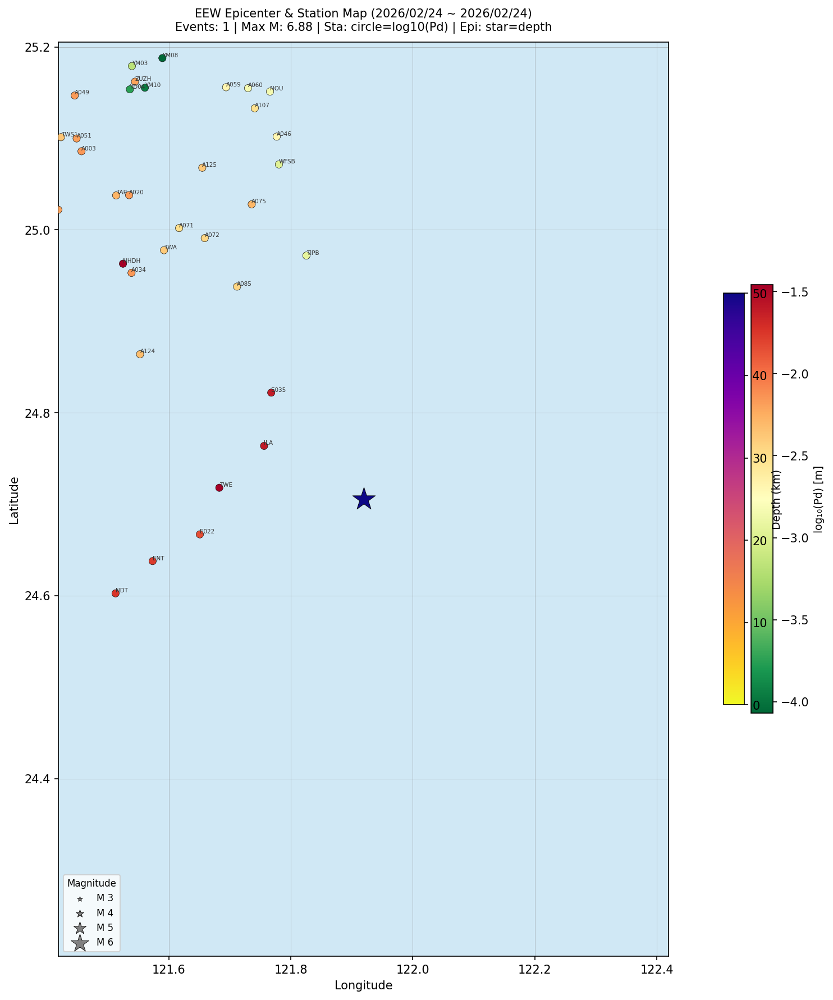

# Earthworm EEW 報告分析 / EEW Report Analysis

> **分析日期：** 2026-03-23  
> **資料期間：** 2026/02/24 ~ 2026/02/24

---

## 一、資料概覽

| 項目 | 數值 |
|------|------|
| 總報告數 | 1 |
| 最終報告（`.rep`） | 1 |
| 初步預警（`_f42.rep`） | 0 |

---

## 二、震源參數

### 規模（Mall）

| | 最小 | 最大 | 平均 | 中位數 |
|-|------|------|------|--------|
| Mall | 6.88 | 6.88 | 6.88 | 6.88 |

#### 規模分布

| 規模 | 數量 | 比例 |
|------|------|------|
| M 2–3 | 0 | 0.0% |
| M 3–4 | 0 | 0.0% |
| M 4–5 | 0 | 0.0% |
| M 5–6 | 0 | 0.0% |
| M 6–7 | 1 | 100.0% |
| M 7–9 | 0 | 0.0% |

### 深度（Depth）

| | 最小 | 最大 | 平均 | 中位數 |
|-|------|------|------|--------|
| 深度(km) | 50.00 | 50.00 | 50.00 | 50.00 |

---

## 三、Top 5 最大事件

| 時間 | 規模 | 緯度 | 經度 | 深度 | 測站數 |
|------|------|------|------|------|--------|
| 2026/02/24 04:37:38.31 | M 6.88 | 24.706°N | 121.919°E | 50 km | 63 |

---

## 四、每日事件數

| 日期 | 最終報告數 |
|------|------------|
| 2026/02/24 | 1 |

---

## 五、系統效能

### 處理時間（process_time）

| | 最小 | 最大 | 平均 | 中位數 |
|-|------|------|------|--------|
| 秒 | 19.85 | 19.85 | 19.85 | 19.85 |

| 時間區間 | 數量 | 比例 |
|----------|------|------|
| 0–5 秒 | 0 | 0.0% |
| 5–10 秒 | 0 | 0.0% |
| 10–15 秒 | 0 | 0.0% |
| 15–20 秒 | 1 | 100.0% |
| 20–30 秒 | 0 | 0.0% |
| 30–∞ 秒 | 0 | 0.0% |

### 使用測站數

| | 最小 | 最大 | 平均 |
|-|------|------|------|
| 測站 | 63.00 | 63.00 | 63.00 |

---

## 六、品質評估（Q 值）

| Q 值 | 數量 | 說明 |
|------|------|------|
| Q=-3 | 1 | 一般 |

---

## 地圖 / Map

---

*報告產製：OpenClaw EEW Rep Analyzer | 2026-03-23 21:42*  
*資料版權：中央氣象署地震測報中心*
