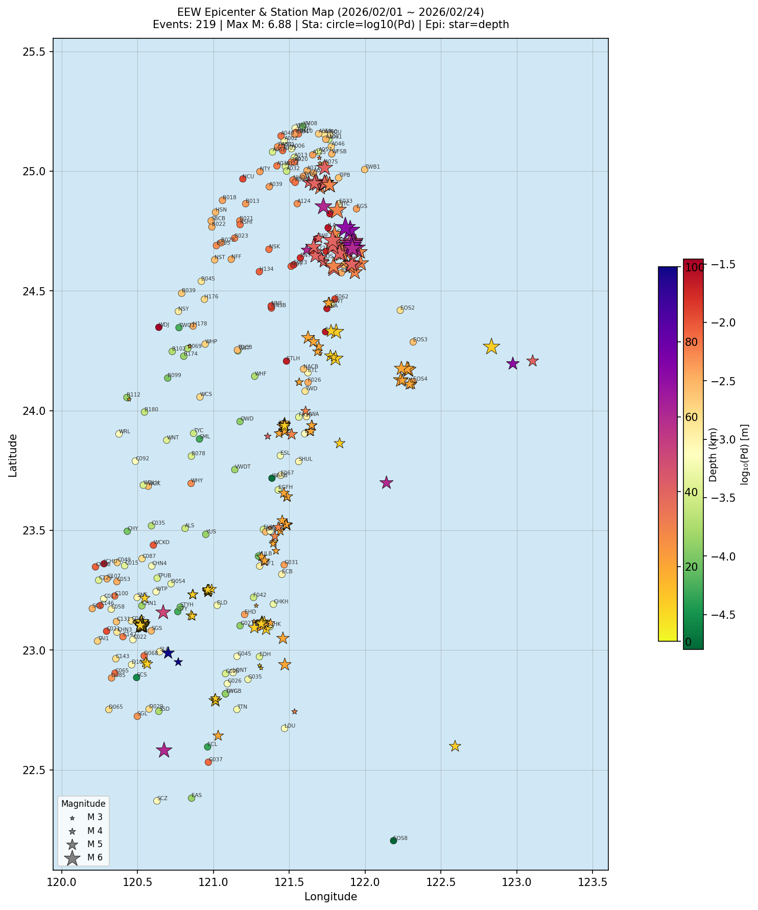

# Earthworm EEW 報告分析 / EEW Report Analysis

> **分析日期：** 2026-03-23  
> **資料期間：** 2026/02/01 ~ 2026/02/24

---

## 一、資料概覽

| 項目 | 數值 |
|------|------|
| 總報告數 | 873 |
| 最終報告（`.rep`） | 219 |
| 初步預警（`_f42.rep`） | 654 |

---

## 二、震源參數

### 規模（Mall）

| | 最小 | 最大 | 平均 | 中位數 |
|-|------|------|------|--------|
| Mall | 2.47 | 6.88 | 5.09 | 5.03 |

#### 規模分布

| 規模 | 數量 | 比例 |
|------|------|------|
| M 2–3 | 4 | 1.8% |
| M 3–4 | 19 | 8.7% |
| M 4–5 | 81 | 37.0% |
| M 5–6 | 86 | 39.3% |
| M 6–7 | 29 | 13.2% |
| M 7–9 | 0 | 0.0% |

### 深度（Depth）

| | 最小 | 最大 | 平均 | 中位數 |
|-|------|------|------|--------|
| 深度(km) | 10.00 | 100.00 | 23.29 | 20.00 |

---

## 三、Top 5 最大事件

| 時間 | 規模 | 緯度 | 經度 | 深度 | 測站數 |
|------|------|------|------|------|--------|
| 2026/02/24 04:37:38.31 | M 6.88 | 24.706°N | 121.919°E | 50 km | 63 |
| 2026/02/24 04:37:40.19 | M 6.86 | 24.699°N | 121.902°E | 50 km | 68 |
| 2026/02/24 04:37:44.72 | M 6.81 | 24.764°N | 121.870°E | 70 km | 105 |
| 2026/02/24 04:37:47.08 | M 6.77 | 24.688°N | 121.912°E | 70 km | 114 |
| 2026/02/24 04:37:43.57 | M 6.69 | 24.678°N | 121.937°E | 60 km | 107 |

---

## 四、每日事件數

| 日期 | 最終報告數 |
|------|------------|
| 2026/02/01 | 6 |
| 2026/02/03 | 1 |
| 2026/02/04 | 12 |
| 2026/02/05 | 4 |
| 2026/02/06 | 1 |
| 2026/02/08 | 10 |
| 2026/02/10 | 2 |
| 2026/02/12 | 13 |
| 2026/02/13 | 15 |
| 2026/02/14 | 8 |
| 2026/02/15 | 7 |
| 2026/02/16 | 20 |
| 2026/02/17 | 1 |
| 2026/02/18 | 2 |
| 2026/02/19 | 8 |
| 2026/02/20 | 30 |
| 2026/02/22 | 23 |
| 2026/02/24 | 56 |

---

## 五、系統效能

### 處理時間（process_time）

| | 最小 | 最大 | 平均 | 中位數 |
|-|------|------|------|--------|
| 秒 | 6.93 | 45.83 | 16.04 | 14.10 |

| 時間區間 | 數量 | 比例 |
|----------|------|------|
| 0–5 秒 | 0 | 0.0% |
| 5–10 秒 | 29 | 13.2% |
| 10–15 秒 | 97 | 44.3% |
| 15–20 秒 | 47 | 21.5% |
| 20–30 秒 | 38 | 17.4% |
| 30–∞ 秒 | 8 | 3.7% |

### 使用測站數

| | 最小 | 最大 | 平均 |
|-|------|------|------|
| 測站 | 5.00 | 114.00 | 21.32 |

---

## 六、品質評估（Q 值）

| Q 值 | 數量 | 說明 |
|------|------|------|
| Q=0 | 9 | 最佳（解完全收斂） |
| Q=-1 | 6 | 良好 |
| Q=-2 | 18 | 良好 |
| Q=-3 | 55 | 一般 |
| Q=-4 | 30 | 可接受 |
| Q=-5 | 15 | 偏低 |
| Q=-6 | 81 | 偏低（Gap 角度問題） |
| Q=-7 | 1 | 低品質 |
| Q=-8 | 2 | 低品質 |
| Q=-10 | 2 | 低品質 |

---

## 地圖 / Map

---

*報告產製：OpenClaw EEW Rep Analyzer | 2026-03-23 21:21*  
*資料版權：中央氣象署地震測報中心*
